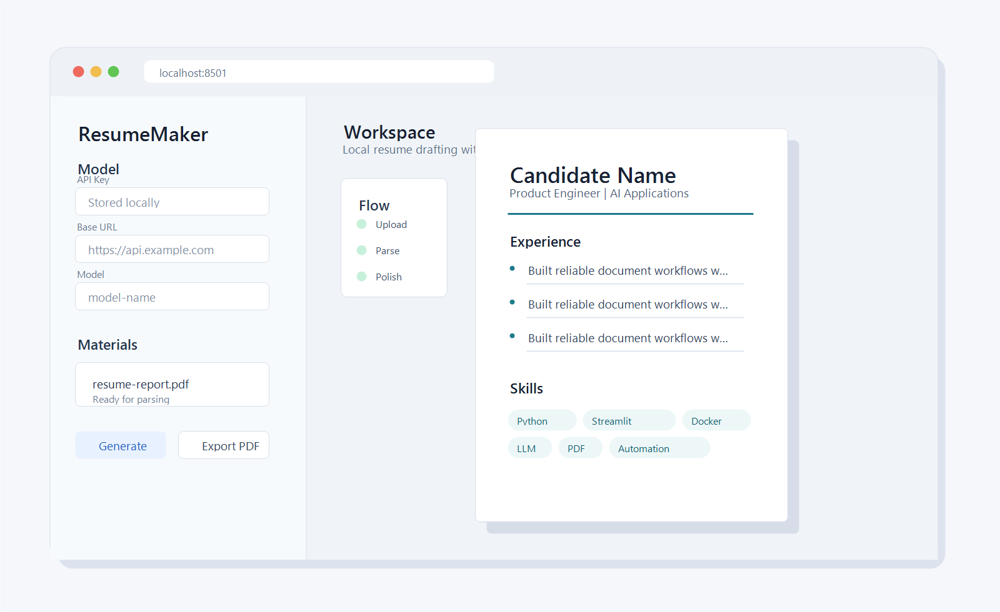

# ResumeMaker

Dockerized Streamlit resume builder with LLM-assisted parsing, polishing, preview, and export.



## Quick Start

```bash
git clone https://github.com/lildengzi/ResumeMaker.git
cd ResumeMaker
docker compose up -d
```

Open `http://localhost:8501`.

Configure your model in the app sidebar:

- `API Key`
- `Base URL`
- `Model`

The app saves these settings locally under `./data/config.json`. The `data/` directory is ignored by Git, so your uploaded materials and model credentials are not committed.

## Optional Environment File

You can copy the example file if you prefer environment-based defaults:

```bash
cp .env.example .env
docker compose up -d
```

The sidebar configuration is still the normal path for changing model settings after the app starts.

## Update

```bash
git pull
docker compose up -d --build
```

## Notes

- Requires Docker and Docker Compose.
- Local app data lives in `./data`.
- Do not commit `.env`, `data/`, uploaded resumes, reports, logs, or generated private materials.
